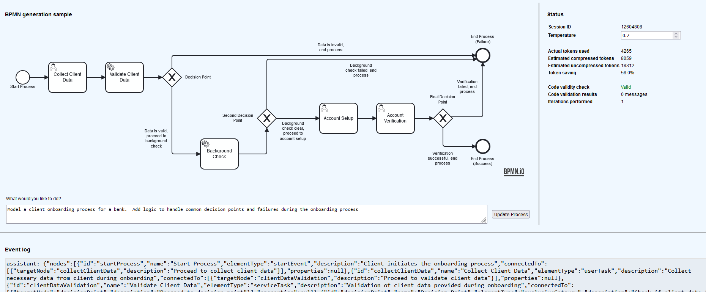

# GPT Codegen
BPMN and code generation with integration to OpenAI ChatGPT APIs.  This is a proof-of-concept implementation under active development.

# Example
The default configuration is set up for BPMN 2.0 process model generation, based upon a description of a business process or a change to an existing process.  A simple example is shown below.  No details are given for the business process so the model has generated a sensible suggestion

# Details
The service integrates with models through a generic LLM API, with built-in support for GPT-5 through OpenAI API services.  It uses a number of mechanisms to support accurate process model generation
* Use of an **intermediate**, JSON Schema-defined data format for interaction with the language model.  The language model is instructed on this format and the service handles transformation to and from the more complex & verbose BPMN format
* **Fuzzy matching** of model responses.  For example, the model will sometimes return additional data, explanation, or formatting even when given specific requests to the contrary
* **Automated validation** of model responses.  In the case of BPMN generation this involves both validation against the JSON schema, and validation of BPMN model correctness when constructing the process model.  The language model is automatically prompted to correct any errors if they are detected, up to a maximum number of iterations
* **Multi-level generation**.  Generation is performed by a multi-level process which iterates and performs self-error correction, to progressively build up a full model solution.
* **Context limitation**.  The context size grows quickly when dealing with large amount of data, such as these large process model definitions.  We generate a new context on every iteration beyond the first which is specifically constrained to:
  * The current user request 'N', wrapped in a prompt template
  * The output of the previous request 'N-1', wrapped in a custom prompt template which defines it as the current state on which the model should apply request N

  We find that the quality of responses is not noticeably degraded by limiting the history in this way.  However the model runtime, token usage and cost are significantly reduced.  We calculate an approximate token saving between compressed/uncompressed contexts which improves with each request and exceeds 70% saving within a few iterations of BPMN generation.

# Instructions
The project includes a Java 17 Spring-based service, and a basic React UI for interacting with the service.  **No pre-compiled binaries are currently provided** since the project is currently in active development.  Compiled releases will be provided when the project is more suitable for general usage.  If you still wish to run the projects from source you can follow the steps below

To run the example service (`./codegen-service`)
1. Ensure you have JDK 17 and Maven installed
1. Create a file in src/main/resources containing your API Key for Open AI.  Update the `app.tokenPath` property in `application.yml` (or pass `--app.tokenPath=/path/to/token/file` when running the app later) to reference your token file
1. Run `mvn clean install` to build the application and then `java -jar <output-jar>`
1. The application will start serving requests on port `8080` by default, configurable in the `application.yml`

To run the UI (`./codegen-ui`)
1. Ensure you have at least NPM 9.5.1 and NodeJS 18.16.0 installed
1. Navigate to the `codegen-ui` directory and run `npm install` for one-time installation, then `npm start` to run a development build of the UI

To reiterate, the project is in development mode right now.  Feel free to run the application via the steps above but be aware this is for local development and debugging only.  A compiled release version will be published once the project is more suitable for general usage.
